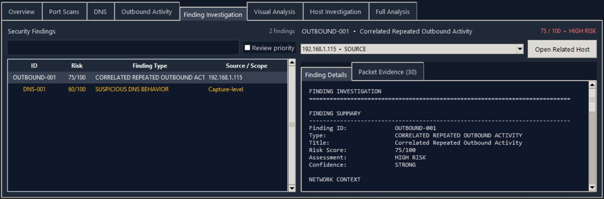
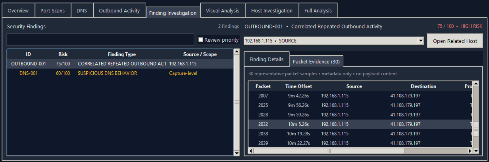
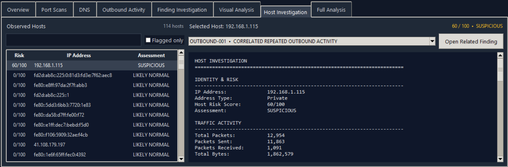
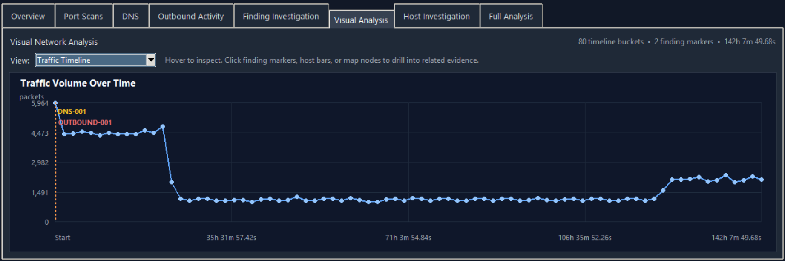
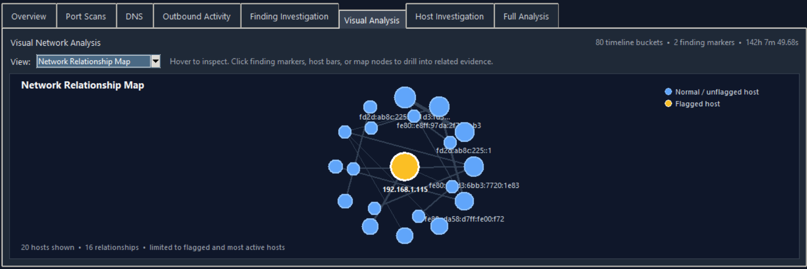

# AI PCAP Security Analyzer

A Python-based defensive network traffic analysis tool that analyzes PCAP files and identifies suspicious network behavior such as port scanning, unusual DNS activity, repeated outbound connection attempts, and other traffic anomalies.

The project focuses on network traffic analysis, SOC-style investigation, explainable detection logic, evidence review, and presenting security findings through both a command-line interface and desktop GUI.

## Features

- PCAP analysis using PyShark
- Desktop GUI security dashboard
- Command-line analysis mode
- Background PCAP processing to keep the GUI responsive
- Determinate packet-processing progress
- IPv4 and IPv6 traffic statistics
- Protocol counting
- Top network conversation analysis
- DNS activity analysis
- Suspicious DNS behavior detection
- TCP SYN port scan detection
- Correlated repeated outbound activity detection
- Generic network behavior scoring
- Overall risk score from 0 to 100
- Human-readable threat summary
- Host Investigation workspace
- Finding Investigation workspace
- Representative packet evidence metadata
- Cross-linked finding and host navigation
- Interactive visual analysis charts
- Interactive network relationship map
- Built-in automated explanation
- Optional AI-generated analyst explanation
- Optional TXT and JSON report export
- GUI buttons for opening exported reports and their folder
- Interactive CLI menu for analyzing multiple PCAP files

## Desktop GUI

Version 1.3 expands the desktop interface into a more complete investigation dashboard.

The GUI includes:

- PCAP file selection
- Optional AI explanation control
- Optional TXT and JSON report export
- Background analysis so the interface remains responsive
- Packet-processing progress with processed and total packet counts
- Overall assessment, risk score, and packet-count cards
- Threat category summary
- Dedicated views for:
  - Overview
  - Port scans
  - DNS activity
  - Correlated outbound activity
  - Host Investigation
  - Finding Investigation
  - Visual Analysis
  - Full Analysis
- Report controls for opening TXT reports, JSON reports, and the report folder
- Scrollable dashboard layout for smaller windows

Behavioral findings are intended to support defensive investigation and are not proof of compromise.

## Investigation Workflow

### Finding Investigation

Structured security findings are assigned identifiers such as:

- `SCAN-001`
- `OUTBOUND-001`
- `DNS-001`
- `FLOW-001`

Each finding can include:

- Risk score and assessment
- Confidence
- Source or scope
- Target and protocol context
- Timing information
- Detection indicators
- Related hosts
- Defensive notes
- Type-specific evidence
- Representative packet metadata

Findings can be filtered and reviewed by priority.



### Packet Evidence

Findings can include a bounded set of representative packet metadata to help explain why the behavior was detected.

Displayed metadata can include:

- Packet number
- Timestamp
- Capture offset
- Source and destination
- Protocol
- Source and destination ports
- Packet length
- TCP flags
- DNS query name when relevant
- A short explanation of why the packet is relevant

Packet payload content is not displayed in the Packet Evidence view.



### Host Investigation

The Host Investigation workspace summarizes activity for individual IP addresses.

It can show:

- Host risk score and assessment
- Packets and bytes sent and received
- TCP SYN attempts
- DNS activity
- Top destinations
- Top destination ports
- Protocol breakdown
- Port scans started or received
- Related outbound findings
- Related structured findings

Being the target of suspicious traffic does not automatically make a host suspicious.



### Cross-Linked Navigation

The GUI supports investigation paths such as:

```text
Finding → Host
Host → Finding
Timeline → Finding
Host Chart → Host
Network Map → Host
```

This allows an analyst to move between detections, hosts, timelines, packet evidence, and network relationships without manually searching for the same IP address or finding.

## Visual Analysis

Version 1.3 adds several interactive views for understanding capture behavior.

### Traffic Timeline

Shows packet activity over the duration of the capture.

Structured security findings can appear as timeline markers so detected behavior can be compared with surrounding traffic.



### DNS Activity Timeline

Shows DNS query activity over time and can help identify concentrated or unusually heavy DNS behavior.

### Protocol Distribution

Shows the protocols that make up the capture and their relative packet counts.

### Most Active Hosts

Ranks hosts by total observed packet activity.

The busiest host is not automatically suspicious, but this view helps identify systems that may deserve investigation.

### Top Destination Ports

Shows destination ports receiving the most traffic.

This can help highlight common services as well as less-common ports associated with repeated behavior.

### Network Relationship Map

Shows relationships between major hosts in the capture.

- Nodes represent hosts
- Lines represent observed communication relationships
- Larger nodes represent more active hosts
- Thicker lines represent more packet traffic between two hosts
- Flagged hosts use their risk color
- Normal or unflagged hosts are displayed separately
- Hovering shows host or relationship details
- Clicking a host opens it in Host Investigation

For larger captures, the map is intentionally limited to flagged and highly active hosts so the visualization remains readable.



## Detection Methods

### Port Scan Detection

The analyzer tracks initial TCP SYN packets and looks for a single source contacting a large number of destination ports on the same target.

The detector considers:

- Number of unique destination ports
- Number of TCP SYN attempts
- Number of service and registered ports contacted
- Scan rate over time

The analyzer assigns either a `MODERATE` or `STRONG` scan confidence when the behavior exceeds configured thresholds.

### Suspicious DNS Behavior

DNS traffic is evaluated using several behavioral indicators:

- Total DNS query volume
- Number of unique domains
- Unique-domain ratio
- Concentration of queries toward a single domain
- Long DNS query names
- Very long DNS query names
- Average DNS query-name length

Multiple indicators are combined into a DNS behavior score.

### Correlated Repeated Outbound Activity

The analyzer looks for repeated TCP connection attempts from an internal host toward the same destination port across multiple external IP addresses.

The detector considers:

- Number of TCP SYN attempts
- Number of external destinations
- Destination port
- Timing between connection attempts
- Timing consistency
- Use of common or less-common destination ports

This behavior may indicate automated network activity, but it does not by itself prove malware or compromise.

### Generic Network Behavior

Individual network flows are also checked for characteristics such as:

- High packet rates
- Large data transfers
- Significant one-directional traffic
- Use of less-common destination ports

These findings are used as supporting evidence rather than standalone proof of malicious activity.

## Risk Scoring

The analyzer combines detected behaviors into an overall risk score.

| Score | Assessment |
|---|---|
| 75-100 | HIGH RISK |
| 50-74 | SUSPICIOUS |
| 25-49 | REVIEW RECOMMENDED |
| 0-24 | LIKELY NORMAL |

The score is intended to prioritize traffic for investigation and should not be treated as proof that a system is compromised.

## Optional AI Explanation

The core analyzer does not require AI or a paid API service.

All packet analysis, detections, scoring, and built-in explanations are performed locally using Python and PyShark.

An optional AI explanation feature can send structured analyzer findings to the OpenAI API and produce an analyst-style summary.

The raw PCAP file is not sent to the AI model.

If AI access is unavailable, disabled, or the API request fails, the analyzer falls back to its built-in explanation and continues operating normally.

## Validation Dataset

The analyzer was tested using the CTU-IDSEVAL-6 intrusion detection evaluation dataset.

The dataset contains six PCAP captures:

- 1 benign traffic capture
- 2 malware-labeled captures
- 3 port-scan-labeled captures

During the Version 1.3 regression test:

| Capture | Result |
|---|---|
| Benign user traffic | `0/100` — `LIKELY NORMAL` |
| Malware-labeled capture 1 | `95/100` — `HIGH RISK` |
| Malware-labeled capture 2 | `100/100` — `HIGH RISK` |
| Port-scan capture 1 | `60/100` — `SUSPICIOUS` |
| Port-scan capture 2 | `50/100` — `SUSPICIOUS` |
| Port-scan capture 3 | `60/100` — `SUSPICIOUS` |

The expected suspicious behavior was identified in all five malicious or scan-labeled captures while the benign capture remained at `0/100`.

These results only describe this small six-capture validation set and should not be interpreted as a general detection accuracy percentage.

The Version 1.3 regression also verified:

- Finding Investigation
- Packet Evidence
- Host Investigation
- Visual Analysis
- Network Relationship Map
- Cross-linked investigation navigation
- TXT and JSON report export
- Command-line analysis

## Example Results

### Benign Traffic

The benign capture received a **0/100** risk score with no threat categories detected.


### Port Scan Detection

The analyzer identified a strong TCP SYN port-scanning pattern involving 945 distinct service or registered destination ports.


### High-Risk Traffic

The analyzer identified both correlated repeated outbound activity and suspicious DNS behavior, resulting in a **95/100 HIGH RISK** assessment.


### Desktop Dashboard


## Installation

### Requirements

- Python 3
- Wireshark/TShark
- PyShark
- OpenAI Python package for the optional AI explanation feature

Clone the repository and move into the project folder:

```powershell
git clone https://github.com/trentitan16/AI-PCAP-Security-Analyzer.git
cd AI-PCAP-Security-Analyzer
```

Create and activate a virtual environment on Windows:

```powershell
python -m venv .venv
.\.venv\Scripts\Activate.ps1
```

Install the Python dependencies:

```powershell
pip install -r requirements.txt
```

Wireshark/TShark must also be installed and available for PyShark to process PCAP files.

## Usage

### Desktop GUI

Start the graphical interface with:

```powershell
python .\gui.py
```

Then:

1. Select a `.pcap`, `.pcapng`, or `.cap` file.
2. Choose whether to generate an optional AI explanation.
3. Choose whether to save TXT and JSON reports.
4. Click **Analyze PCAP**.
5. Review the dashboard and investigation views.
6. If reports were saved, use the report buttons to open them or their containing folder.

### Command Line

Start the CLI with:

```powershell
python .\analyzer.py
```

Follow the interactive prompts to select and analyze PCAP files.

## OpenAI API Setup

The AI explanation feature is optional. The analyzer works without an API key.

If AI explanations are enabled, the OpenAI Python SDK reads the API key from the `OPENAI_API_KEY` environment variable.

Do not commit API keys or other credentials to the repository.

## Report Files

When report export is enabled, the analyzer creates:

```text
<pcap_name>_security_report.txt
<pcap_name>_security_report.json
```

Reports are saved beside the analyzed PCAP file.

Generated reports and PCAP captures are excluded from Git tracking by the project's `.gitignore`.

## Project Structure

```text
AI-PCAP-Security-Analyzer/
├── analyzer.py
├── gui.py
├── requirements.txt
├── README.md
├── .gitignore
└── docs/
    └── screenshots/
        ├── benign-result.png
        ├── portscan-result.png
        ├── high-risk-result.png
        └── gui-dashboard.png
```

## Limitations

- The analyzer uses heuristic and behavioral detection rather than signature-based malware identification.
- A suspicious finding does not prove that a host is compromised.
- Encrypted traffic limits visibility into application-layer content.
- Detection thresholds may behave differently on networks and datasets that differ from the validation captures.
- The validation results come from a small six-capture dataset and are not a general accuracy measurement.
- The tool is not intended to replace a production IDS, SIEM, EDR, or professional incident-response process.
- AI-generated explanations are optional summaries of structured findings and do not determine the analyzer's core risk score.
- The Network Relationship Map intentionally limits large captures to a subset of flagged and highly active hosts for readability.
- Representative Packet Evidence is a bounded metadata sample and is not intended to display every packet associated with a finding.

## Version 1.3.0

Version 1.3.0 expands the project from a detection dashboard into a cross-linked network investigation workspace.

Major additions include:

- Structured Finding Investigation
- Finding identifiers and review-priority filtering
- Representative Packet Evidence
- Host Investigation improvements
- Finding-to-host and host-to-finding navigation
- Timeline-to-finding navigation
- Host-chart-to-host navigation
- Interactive Traffic Timeline
- DNS Activity Timeline
- Protocol Distribution chart
- Most Active Hosts chart
- Top Destination Ports chart
- Interactive Network Relationship Map
- Network-map-to-host navigation
- Determinate packet-processing progress
- Structured visualization and relationship-map backend data
- Regression validation across all six CTU-IDSEVAL-6 captures
- Report export regression testing
- Command-line regression testing

Detection thresholds were intentionally kept stable while the investigation and visualization layers were expanded.

## Version 1.2.0

Version 1.2.0 added:

- Host Investigation
- Host-level activity summaries
- Suspicious-host prioritization
- Port-scan target context
- Determinate packet-processing progress
- Improved GUI investigation workflow

## Version 1.1.0

Version 1.1.0 introduced the desktop GUI and expanded the project from a command-line analyzer into a graphical defensive network-analysis application.

Major additions included:

- Security dashboard GUI
- Responsive background analysis
- Optional AI control in the GUI
- Optional report export in the GUI
- TXT and JSON report access controls
- Scrollable dashboard layout
- Improved presentation of detection results

## Disclaimer

This project is intended for defensive cybersecurity education, authorized network analysis, and portfolio demonstration.

Only analyze network captures that you are authorized to access.
