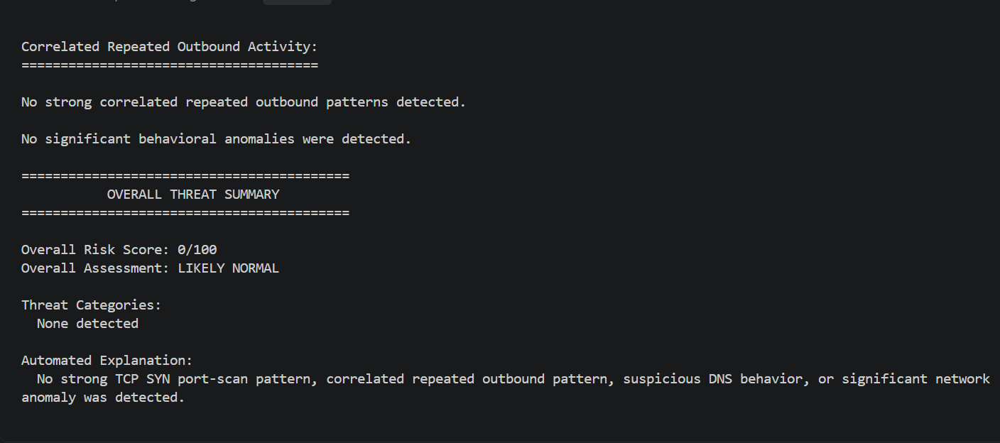
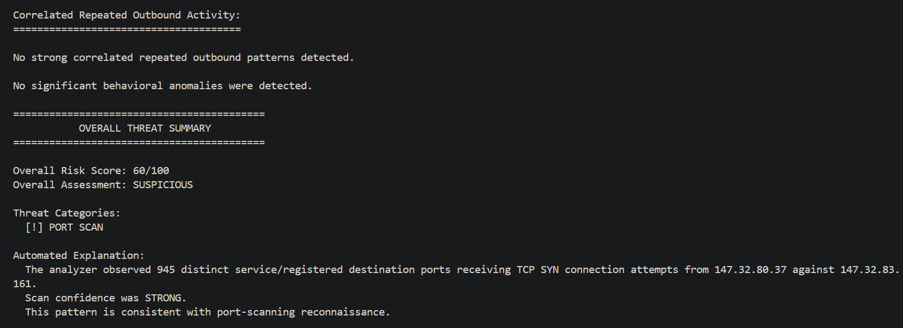
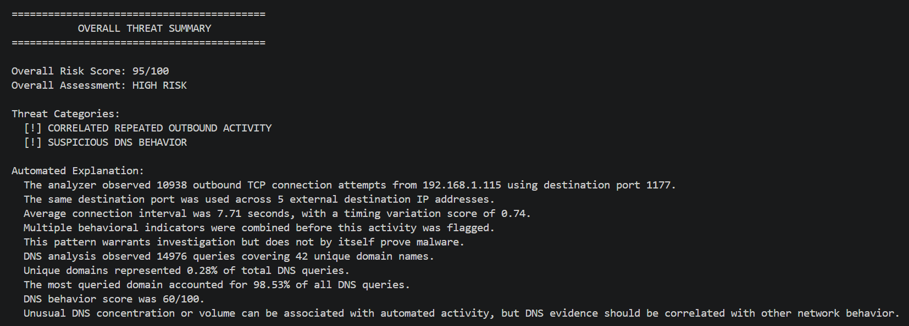

# AI PCAP Security Analyzer

A Python-based defensive network traffic analysis tool that analyzes PCAP files and identifies suspicious network behavior such as port scanning, unusual DNS activity, repeated outbound connection attempts, and other traffic anomalies.

The analyzer is designed as a cybersecurity portfolio project focused on network traffic analysis, SOC-style investigation, and explainable detection logic.

## Features

- PCAP analysis using PyShark
- IPv4 and IPv6 traffic statistics
- Protocol counting
- Top network conversation analysis
- DNS activity analysis
- Suspicious DNS behavior detection
- TCP SYN port scan detection
- Correlated repeated outbound activity detection
- Generic network behavior scoring
- Overall risk score from 0 to 100
- Human-readable threat summary
- Built-in automated explanation
- Optional AI-generated analyst explanation
- TXT and JSON report export
- Interactive menu for analyzing multiple PCAP files

## Detection Methods

### Port Scan Detection

The analyzer tracks initial TCP SYN packets and looks for a single source contacting a large number of destination ports on the same target.

The detector considers:

- Number of unique destination ports
- Number of TCP SYN attempts
- Number of service and registered ports contacted
- Scan rate over time

The analyzer assigns either a MODERATE or STRONG scan confidence when the behavior exceeds configured thresholds.

### Suspicious DNS Behavior

DNS traffic is evaluated using several behavioral indicators:

- Total DNS query volume
- Number of unique domains
- Unique-domain ratio
- Concentration of queries toward a single domain
- Long DNS query names
- Very long DNS query names
- Average DNS query-name length

Multiple indicators are combined into a DNS behavior score.

### Correlated Repeated Outbound Activity

The analyzer looks for repeated TCP connection attempts from an internal host toward the same destination port across multiple external IP addresses.

The detector considers:

- Number of TCP SYN attempts
- Number of external destinations
- Destination port
- Timing between connection attempts
- Timing consistency
- Use of common or less-common destination ports

This behavior may indicate automated network activity, but it does not by itself prove malware or compromise.

### Generic Network Behavior

Individual network flows are also checked for characteristics such as:

- High packet rates
- Large data transfers
- Significant one-directional traffic
- Use of less-common destination ports

These findings are used as supporting evidence rather than standalone proof of malicious activity.

## Risk Scoring

The analyzer combines detected behaviors into an overall risk score.

| Score | Assessment |
|---|---|
| 75-100 | HIGH RISK |
| 50-74 | SUSPICIOUS |
| 25-49 | REVIEW RECOMMENDED |
| 0-24 | LIKELY NORMAL |

The score is intended to prioritize traffic for investigation and should not be treated as proof that a system is compromised.

## Optional AI Explanation

The core analyzer does not require AI or a paid API service.

All packet analysis, detections, scoring, and built-in explanations are performed locally using Python and PyShark.

An optional AI explanation feature can send structured analyzer findings to the OpenAI API and produce an analyst-style summary.

The raw PCAP file is not sent to the AI model.

If AI access is unavailable, disabled, or the API request fails, the analyzer automatically falls back to its built-in explanation and continues operating normally.

## Validation Dataset

The analyzer was tested using the CTU-IDSEVAL-6 intrusion detection evaluation dataset.

The dataset contains six PCAP captures:

- 1 benign traffic capture
- 2 malware-labeled captures
- 3 port-scan-labeled captures

During this small validation set:

- The benign capture produced a 0/100 risk score and LIKELY NORMAL assessment.
- Expected suspicious behavior was identified in both malware-labeled captures.
- Expected scanning behavior was identified in all three port-scan-labeled captures.

These results only describe testing on this dataset and should not be interpreted as a general detection accuracy percentage.

## Example Results

### Benign Traffic

The benign capture received a **0/100** risk score with no threat categories detected.

### Port Scan Detection

The analyzer identified a strong TCP SYN port-scanning pattern involving 945 distinct service/registered destination ports.

### High-Risk Traffic

The analyzer identified both correlated repeated outbound activity and suspicious DNS behavior, resulting in a **95/100 HIGH RISK** assessment.

