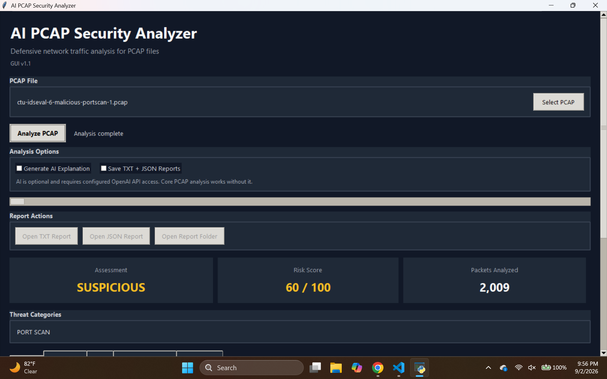

# AI PCAP Security Analyzer

A Python-based defensive network traffic analysis tool that analyzes PCAP files and identifies suspicious network behavior such as port scanning, unusual DNS activity, repeated outbound connection attempts, and other traffic anomalies.

The project is focused on network traffic analysis, SOC-style investigation, explainable detection logic, and presenting security findings through both a command-line interface and desktop GUI.

## Features

- PCAP analysis using PyShark
- Desktop GUI security dashboard
- Command-line analysis mode
- Background PCAP processing to keep the GUI responsive
- Determinate packet-processing progress bar
- IPv4 and IPv6 traffic statistics
- Protocol counting
- Top network conversation analysis
- DNS activity analysis
- Suspicious DNS behavior detection
- TCP SYN port scan detection
- Correlated repeated outbound activity detection
- Generic network behavior scoring
- Overall risk score from 0 to 100
- Host-level investigation and risk summaries
- Searchable and filterable host investigation view
- Human-readable threat summary
- Built-in automated explanation
- Optional AI-generated analyst explanation
- Optional TXT and JSON report export
- GUI buttons for opening exported reports and their folder
- Interactive CLI menu for analyzing multiple PCAP files

## Desktop GUI

Version 1.2 expands the desktop interface with host-level investigation and real packet-processing progress while preserving the existing defensive detection logic.

The GUI includes:

- PCAP file selection
- Optional AI explanation control
- Optional TXT and JSON report export
- Background analysis so the interface remains responsive
- Green progress bar based on packets processed
- Overall assessment, risk score, and packet-count cards
- Threat category summary
- Dedicated views for:
  - Overview
  - Port scans
  - DNS activity
  - Correlated outbound activity
  - Host Investigation
  - Full analysis
- Report controls for opening TXT reports, JSON reports, and the report folder
- Scrollable dashboard layout for smaller windows

### Host Investigation

The Host Investigation view provides SOC-style visibility into individual IP addresses observed in a capture.

For each host, the analyzer can display:

- Host-specific risk score and assessment
- Packets sent and received
- Bytes sent and received
- TCP SYN attempts
- DNS query count and unique DNS domains
- Threat categories tied to that host
- Port scans started or received
- Correlated repeated outbound findings
- Related network-flow findings
- Top destination IP addresses
- Top destination ports
- DNS activity
- Protocol breakdown

The host table is sorted so higher-risk systems appear first and includes search and a **Flagged only** filter for faster investigation.

A host that is merely the target of suspicious traffic is not automatically assigned a suspicious risk score. Host-level findings are intended to support defensive investigation and are not proof of compromise.

## Detection Methods

### Port Scan Detection

The analyzer tracks initial TCP SYN packets and looks for a single source contacting a large number of destination ports on the same target.

The detector considers:

- Number of unique destination ports
- Number of TCP SYN attempts
- Number of service and registered ports contacted
- Scan rate over time

The analyzer assigns either a `MODERATE` or `STRONG` scan confidence when the behavior exceeds configured thresholds.

### Suspicious DNS Behavior

DNS traffic is evaluated using several behavioral indicators:

- Total DNS query volume
- Number of unique domains
- Unique-domain ratio
- Concentration of queries toward a single domain
- Long DNS query names
- Very long DNS query names
- Average DNS query-name length

Multiple indicators are combined into a DNS behavior score.

### Correlated Repeated Outbound Activity

The analyzer looks for repeated TCP connection attempts from an internal host toward the same destination port across multiple external IP addresses.

The detector considers:

- Number of TCP SYN attempts
- Number of external destinations
- Destination port
- Timing between connection attempts
- Timing consistency
- Use of common or less-common destination ports

This behavior may indicate automated network activity, but it does not by itself prove malware or compromise.

### Generic Network Behavior

Individual network flows are also checked for characteristics such as:

- High packet rates
- Large data transfers
- Significant one-directional traffic
- Use of less-common destination ports

These findings are used as supporting evidence rather than standalone proof of malicious activity.

## Risk Scoring

The analyzer combines detected behaviors into an overall risk score.

| Score | Assessment |
|---|---|
| 75-100 | HIGH RISK |
| 50-74 | SUSPICIOUS |
| 25-49 | REVIEW RECOMMENDED |
| 0-24 | LIKELY NORMAL |

The score is intended to prioritize traffic for investigation and should not be treated as proof that a system is compromised.

Host-level risk scores use the same assessment labels but are calculated from findings tied to the selected host.

## Optional AI Explanation

The core analyzer does not require AI or a paid API service.

All packet analysis, detections, scoring, and built-in explanations are performed locally using Python and PyShark.

An optional AI explanation feature can send structured analyzer findings to the OpenAI API and produce an analyst-style summary.

The raw PCAP file is not sent to the AI model.

If AI access is unavailable, disabled, or the API request fails, the analyzer falls back to its built-in explanation and continues operating normally.

## Validation Dataset

The analyzer was tested using the CTU-IDSEVAL-6 intrusion detection evaluation dataset.

The dataset contains six PCAP captures:

- 1 benign traffic capture
- 2 malware-labeled captures
- 3 port-scan-labeled captures

During this small validation set:

- The benign capture produced a `0/100` risk score and `LIKELY NORMAL` assessment.
- Expected suspicious behavior was identified in both malware-labeled captures.
- Expected scanning behavior was identified in all three port-scan-labeled captures.
- Host Investigation preserved the expected capture-level results during regression testing.
- The benign capture remained free of suspicious host risk scores in the tested configuration.

These results only describe testing on this dataset and should not be interpreted as a general detection accuracy percentage.

## Example Results

### Benign Traffic

The benign capture received a **0/100** risk score with no threat categories detected.


### Port Scan Detection

The analyzer identified a strong TCP SYN port-scanning pattern involving 945 distinct service/registered destination ports.


### High-Risk Traffic

The analyzer identified both correlated repeated outbound activity and suspicious DNS behavior, resulting in a **95/100 HIGH RISK** assessment.


### Desktop Dashboard



## Installation

### Requirements

- Python 3
- Wireshark/TShark
- PyShark
- OpenAI Python package for the optional AI explanation feature

Clone the repository and move into the project folder:

```powershell
git clone https://github.com/trentitan16/AI-PCAP-Security-Analyzer.git
cd AI-PCAP-Security-Analyzer
```

Create and activate a virtual environment on Windows:

```powershell
python -m venv .venv
.\.venv\Scripts\Activate.ps1
```

Install the Python dependencies:

```powershell
pip install -r requirements.txt
```

Wireshark/TShark must also be installed and available for PyShark to process PCAP files.

The progress indicator uses Wireshark's `capinfos` utility when available to determine the total packet count before analysis.

## Usage

### Desktop GUI

Start the graphical interface with:

```powershell
python .\gui.py
```

Then:

1. Select a `.pcap`, `.pcapng`, or `.cap` file.
2. Choose whether to generate an optional AI explanation.
3. Choose whether to save TXT and JSON reports.
4. Click **Analyze PCAP**.
5. Watch packet-processing progress in the progress bar.
6. Review the overall dashboard and detailed analysis tabs.
7. Use **Host Investigation** to search, filter, and inspect individual hosts.
8. If reports were saved, use the report buttons to open them or their containing folder.

### Command Line

Start the CLI with:

```powershell
python .\analyzer.py
```

Follow the interactive prompts to select and analyze PCAP files.

## OpenAI API Setup

The AI explanation feature is optional. The analyzer works without an API key.

If AI explanations are enabled, the OpenAI Python SDK reads the API key from the `OPENAI_API_KEY` environment variable.

Do not commit API keys or other credentials to the repository.

## Report Files

When report export is enabled, the analyzer creates:

```text
<pcap_name>_security_report.txt
<pcap_name>_security_report.json
```

Reports are saved beside the analyzed PCAP file.

Generated reports and PCAP captures are excluded from Git tracking by the project's `.gitignore`.

## Project Structure

```text
AI-PCAP-Security-Analyzer/
├── analyzer.py
├── gui.py
├── requirements.txt
├── README.md
├── .gitignore
└── docs/
    └── screenshots/
        ├── benign-result.png
        ├── portscan-result.png
        ├── high-risk-result.png
        └── gui-dashboard.png
```

## Limitations

- The analyzer uses heuristic and behavioral detection rather than signature-based malware identification.
- A suspicious finding does not prove that a host is compromised.
- A host receiving suspicious traffic is not necessarily itself suspicious.
- Encrypted traffic limits visibility into application-layer content.
- Detection thresholds may behave differently on networks and datasets that differ from the validation captures.
- The validation results come from a small six-capture dataset and are not a general accuracy measurement.
- Host-level risk depends on behaviors the analyzer can correlate to a specific IP address.
- The tool is not intended to replace a production IDS, SIEM, EDR, or professional incident-response process.
- AI-generated explanations are optional summaries of structured findings and do not determine the analyzer's core risk score.

## Version 1.2

Version 1.2 expands the project from capture-level analysis into more detailed SOC-style host investigation.

Major additions include:

- Host Investigation tab
- Per-host risk scores and assessments
- Per-host packet, byte, TCP SYN, DNS, and protocol statistics
- Host-level detection correlation
- Top destination IP and destination-port visibility
- Host search
- Flagged-only host filtering
- Risk-prioritized host table
- Professional host detail view
- Determinate green packet-processing progress bar
- Packet progress status showing processed and total packets
- Regression testing against benign, malware-labeled, and port-scan-labeled captures

The existing capture-level detection thresholds were preserved while these investigation and interface features were added.

## Disclaimer

This project is intended for defensive cybersecurity education, authorized network analysis, and portfolio demonstration.

Only analyze network captures that you are authorized to access.
