# AI PCAP Security Analyzer

A Python-based defensive network traffic analysis tool that analyzes PCAP files and identifies suspicious network behavior such as port scanning, unusual DNS activity, repeated outbound connection attempts, and other traffic anomalies.

The project focuses on network traffic analysis, SOC-style investigation, explainable detection logic, evidence review, case management, and presenting security findings through both a command-line interface and desktop GUI.

## Features

- PCAP analysis using PyShark
- Desktop GUI security dashboard
- Command-line analysis mode
- Background PCAP processing to keep the GUI responsive
- Determinate packet-processing progress
- IPv4 and IPv6 traffic statistics
- Protocol counting
- Top network conversation analysis
- DNS activity analysis
- Suspicious DNS behavior detection
- TCP SYN port scan detection
- Correlated repeated outbound activity detection
- Generic network behavior scoring
- Overall risk score from 0 to 100
- Human-readable threat summary
- Host Investigation workspace
- Finding Investigation workspace
- Representative packet evidence metadata
- Cross-linked finding and host navigation
- Threat Hunt workspace
- Search by IP address, domain, destination port, protocol, or Finding ID
- Packet-to-timeline investigation linking
- Analyst Investigation Queue
- Analyst notes and queue export
- Analyst dispositions and finding review notes
- Detection transparency through **Why Triggered** threshold and score breakdowns
- Unified Investigation Timeline for capture evidence and analyst activity
- Persistent investigation case save/load
- PCAP SHA-256 integrity verification for saved cases
- PCAP / saved-case comparison workspace
- Free local AI explanations through Ollama
- Optional OpenAI API explanations
- Focused AI explanations for findings and hosts
- Persistent AI Investigation Summary
- Indicators of Interest workspace
- Indicators of Interest JSON and CSV export
- Conservative MITRE ATT&CK mapping for supported findings
- Interactive visual analysis charts
- Interactive network relationship map
- Optional TXT, JSON, and packet-evidence CSV report export
- Polished HTML investigation case report export
- GUI buttons for opening exported reports and their folder
- Automated six-capture regression testing
- Interactive CLI menu for analyzing multiple PCAP files

## Desktop GUI

Version 1.6 builds on the grouped workspace design introduced in v1.5 and adds analyst triage, detection transparency, chronological case activity, case comparison, and polished investigation reporting.

Top-level workspaces include:

- **Overview**
- **Detections**
  - Port Scans
  - DNS
  - Outbound Activity
- **Investigation**
  - Threat Hunt
  - Investigation Queue
  - Case Timeline
  - Case Compare
  - Finding Investigation
  - Host Investigation
  - Indicators of Interest
- **AI**
  - AI Investigation Summary
- **Visual Analysis**
- **Full Analysis**

The GUI also includes:

- PCAP file selection
- Save Case and Load Case controls
- Optional AI provider selection
- Optional TXT, JSON, packet-evidence CSV, and HTML case-report export
- Background analysis so the interface remains responsive
- Packet-processing progress
- Overall assessment, risk score, and packet-count cards
- Threat category summary
- Scrollable dashboard layout for smaller windows

Behavioral findings are intended to support defensive investigation and are not proof of compromise.

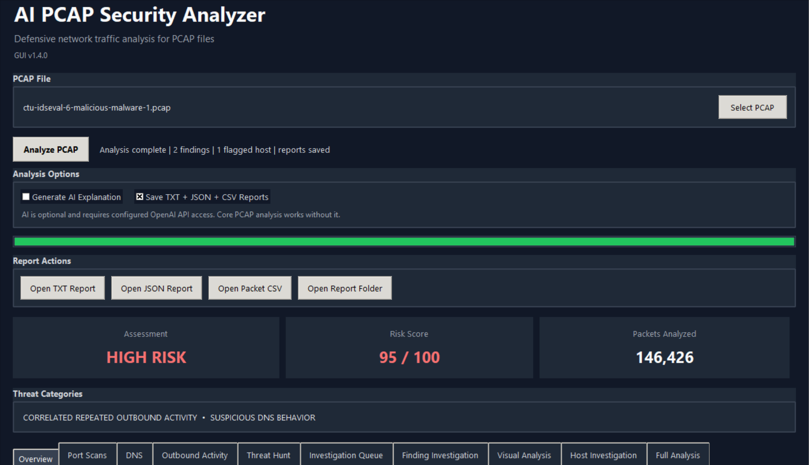

## Investigation Workflow

### Threat Hunt

Version 1.4 added a Threat Hunt workspace for searching metadata collected during analysis without rereading the PCAP.

Supported searches include:

- IP address
- Domain
- Destination port
- Protocol
- Finding ID

Results can include matching hosts, structured findings, representative packet metadata, and host-to-host relationships. Threat Hunt results can link directly into Host Investigation, Finding Investigation, and the Traffic Timeline.

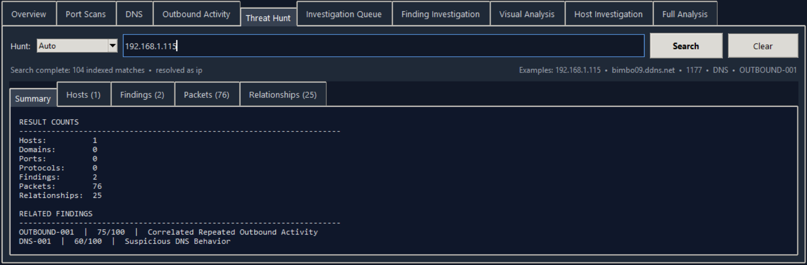

### Investigation Queue

The Investigation Queue allows analysts to bookmark findings, hosts, and representative packets while reviewing a capture.

Analysts can:

- Add findings, hosts, and packets
- Add analyst notes
- Reopen queued findings and hosts
- Send queued packets back to the Traffic Timeline
- Remove individual items
- Clear the queue
- Export the queue as JSON

Version 1.5 also preserves the Investigation Queue and its analyst notes inside saved investigation cases.

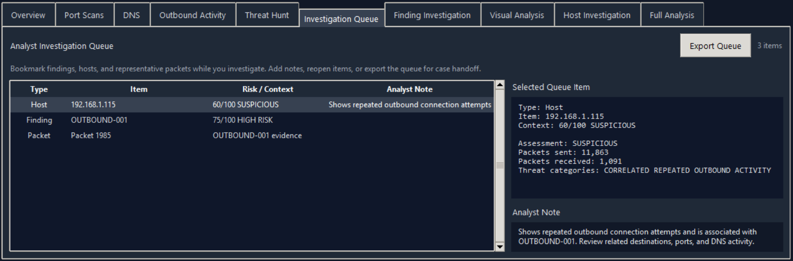

### Analyst Review and Detection Transparency

Version 1.6 adds analyst triage controls directly to structured findings.

Each finding can store an **Analyst Review** with one of the following dispositions:

- `Not Reviewed`
- `Needs Review`
- `Suspicious`
- `Benign / Expected`
- `Confirmed Finding`

Analysts can also save a review note without changing the analyzer's detection score or underlying detection logic.

The **Why Triggered** view explains how an existing finding met the analyzer's current behavioral thresholds. Depending on finding type, it can display:

- Observed activity
- Detector thresholds
- PASS / MISS threshold results
- Score contributions
- Detector confidence
- Final finding score and assessment

The threshold display is explanatory only. The analyzer makes the detection before the GUI renders this view.

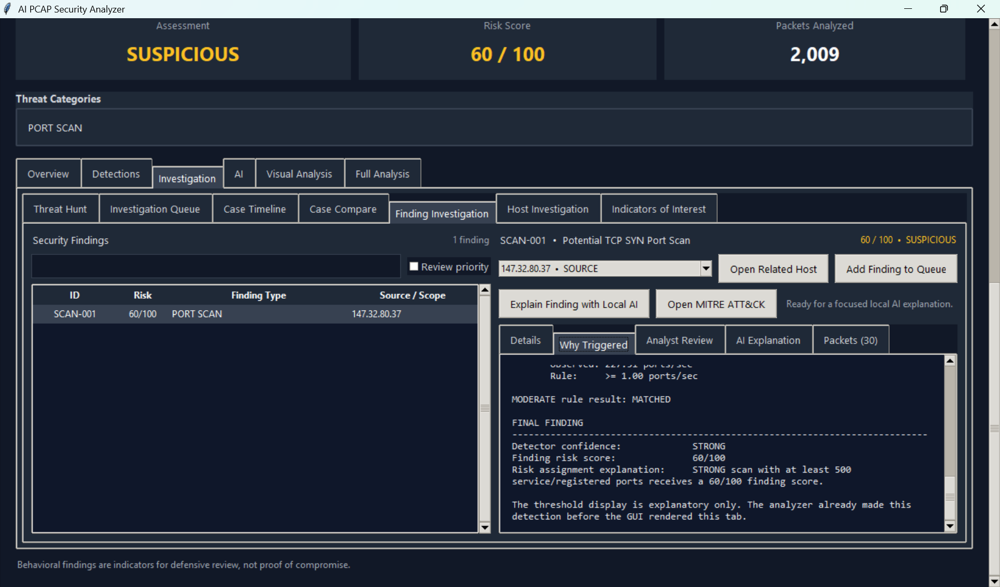

### Unified Investigation Timeline

Version 1.6 adds a chronological case timeline that combines capture-derived evidence with analyst activity in one workspace.

Timeline events can include:

- Finding first-seen events
- Representative packet evidence
- Finding review decisions
- Queued investigation items
- Analyst queue notes

The timeline separates **Capture** events from **Analyst** events and supports filtering so an investigator can review the sequence of network evidence and follow-up actions together.

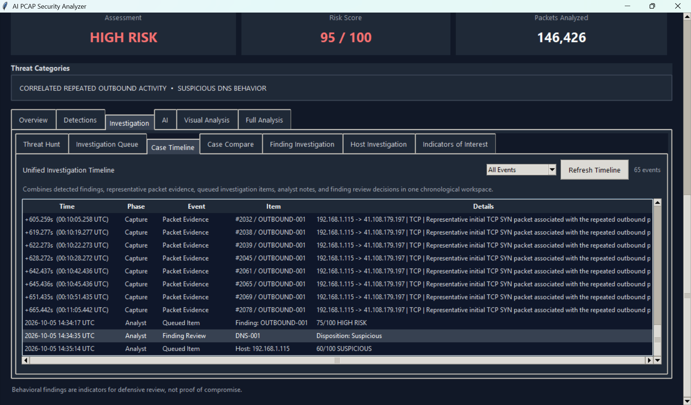

### Persistent Investigation Cases

Version 1.5 adds persistent case save/load support.

A saved `.pcapcase.json` case can preserve:

- Full structured analysis results
- Investigation Queue items
- Analyst queue notes
- Finding analyst dispositions and review notes
- Finding, host, and packet bookmarks
- AI finding explanations
- AI host explanations
- AI Investigation Summary
- Case metadata
- Original PCAP information

A saved case can be reopened without processing the PCAP again.

Case metadata includes:

- Unique case ID
- Case name
- Created timestamp
- Last-saved timestamp
- Application version
- Original PCAP path
- PCAP file size
- PCAP modification time
- SHA-256 hash

When the original PCAP is still available, the GUI can compare its current SHA-256 hash with the hash stored in the case. A mismatch warns the analyst that the source capture may have changed. The saved investigation can still be reviewed if the original PCAP is unavailable.

Saved case files are excluded from Git tracking by the project's `.gitignore`.

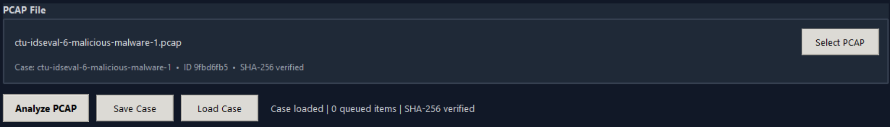

### PCAP / Case Comparison

Version 1.6 adds a comparison workspace for reviewing the active analysis or loaded case against a separately loaded saved reference case.

Loading a reference case does **not** replace the active investigation.

The comparison can show differences in:

- Packets analyzed
- Overall risk score and assessment
- Threat-category count
- Structured findings
- Review-priority and analyst-reviewed findings
- Hosts observed and flagged hosts
- DNS query volume and unique domains
- Port-scan findings
- Repeated outbound findings
- Generic flow findings
- Indicators of Interest
- Finding-type counts
- Analyst disposition counts

The comparison is intended to highlight differences for investigation. A higher score or count does not automatically mean one capture is malicious.

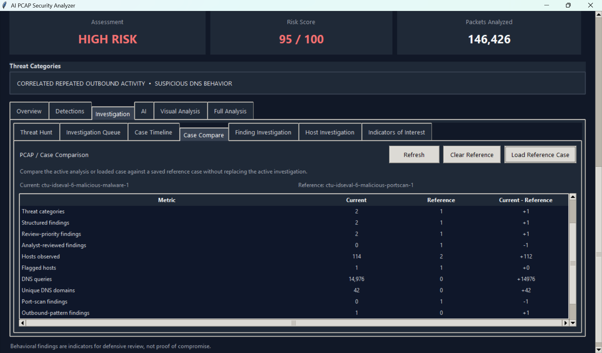

### HTML Investigation Case Report

Version 1.6 adds a browser-friendly HTML case report designed for investigation handoff, portfolio review, and printing to PDF when needed.

The report can include:

- Case metadata and source-capture integrity status
- Overall assessment, risk score, and packet count
- Structured finding summary and finding details
- Analyst dispositions and notes
- Conservative MITRE ATT&CK mappings
- Flagged hosts
- Indicators of Interest
- Investigation Queue items and analyst notes
- Saved AI Investigation Summary
- Unified Investigation Timeline
- Optional Case Comparison snapshot

The generated HTML report uses structured metadata and analyst context and does not embed raw packet payloads.

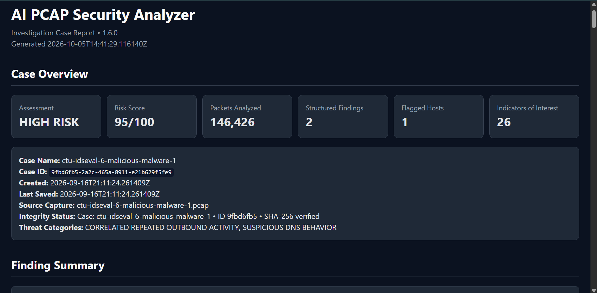

### Finding Investigation

Structured security findings are assigned identifiers such as:

- `SCAN-001`
- `OUTBOUND-001`
- `DNS-001`
- `FLOW-001`

Each finding can include:

- Risk score and assessment
- Confidence
- Source or scope
- Target and protocol context
- Timing information
- Detection indicators
- Related hosts
- Defensive notes
- Type-specific evidence
- Representative packet metadata
- **Why Triggered** detection breakdown
- Analyst disposition and review note
- Optional AI explanation
- MITRE ATT&CK mapping when a conservative mapping is supported

Findings can be filtered and reviewed by priority.

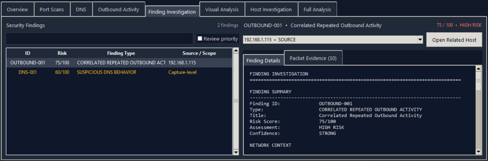

### Packet Evidence

Findings can include a bounded set of representative packet metadata to help explain why behavior was detected.

Displayed metadata can include:

- Packet number
- Timestamp
- Capture offset
- Source and destination
- Protocol
- Source and destination ports
- Packet length
- TCP flags
- DNS query name when relevant
- A short explanation of why the packet is relevant

Packet payload content is not displayed in the Packet Evidence view.

Representative packets can be sent directly to the Traffic Timeline and highlighted at their exact capture offset.

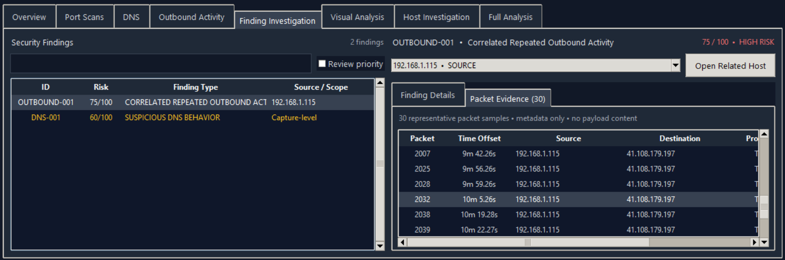

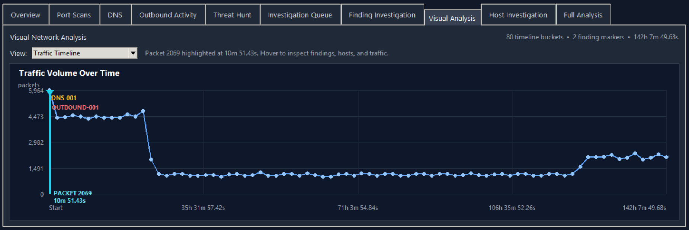

### Host Investigation

The Host Investigation workspace summarizes activity for individual IP addresses.

It can show:

- Host risk score and assessment
- Packets and bytes sent and received
- TCP SYN attempts
- DNS activity
- Top destinations
- Top destination ports
- Protocol breakdown
- Port scans started or received
- Related outbound findings
- Related structured findings
- Optional local-AI explanation

Being the target of suspicious traffic does not automatically make a host suspicious.

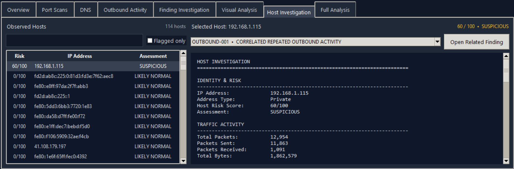

### Indicators of Interest

Version 1.5 adds an Indicators of Interest workspace for collecting network values that deserve defensive review based on structured analyzer findings.

Indicators can include:

- IP addresses
- Domains
- Destination ports
- Related Finding IDs
- Finding risk context
- Representative packet references
- Short context explaining why the value was listed

Indicators can be exported together as JSON and CSV.

The project intentionally calls these **Indicators of Interest** rather than automatically labeling them Indicators of Compromise. A value appearing in this workspace does not prove that it is malicious or that a system is compromised.

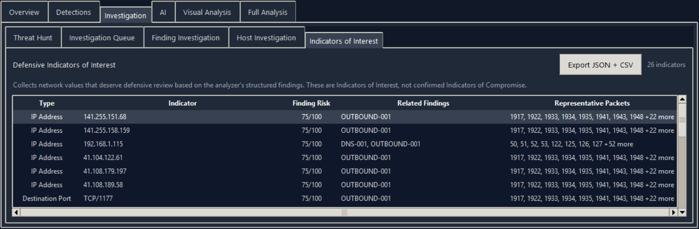

### MITRE ATT&CK Mapping

Version 1.5 adds conservative MITRE ATT&CK references to supported findings.

The current mapping is:

- `T1046` — **Network Service Discovery**
  - Tactic: Discovery
  - Used for explicit port/service-scan findings such as `SCAN-001`

Finding Investigation includes an **Open MITRE ATT&CK** button that opens the official technique reference.

The analyzer does not force ATT&CK mappings onto findings when the available evidence does not support a specific technique. ATT&CK mappings describe observed behavior and do not prove compromise, attribution, or malicious intent.

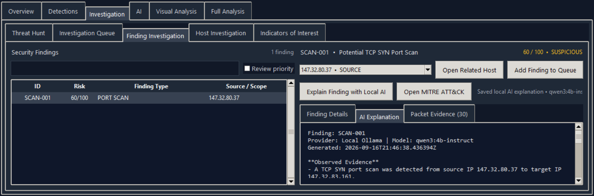

### Cross-Linked Navigation

The GUI supports investigation paths such as:

```text
Finding → Host
Host → Finding
Timeline → Finding
Host Chart → Host
Network Map → Host
Threat Hunt → Host
Threat Hunt → Finding
Packet Evidence → Timeline
Threat Hunt Packet → Timeline
Investigation Queue → Finding
Investigation Queue → Host
Investigation Queue Packet → Timeline
Case Timeline → Finding
Case Timeline → Packet Timeline
Case Timeline → Investigation Queue
```

This allows an analyst to move between detections, hosts, timelines, packet evidence, and network relationships without manually searching for the same IP address or finding.

## AI-Assisted Investigation

The core analyzer does **not** require AI.

All packet processing, detection logic, behavioral scoring, risk scoring, and structured findings are produced by the analyzer itself using Python and PyShark.

AI is an optional explanation layer built on top of those structured results.

### Local Ollama AI

Version 1.5 adds free local AI support through Ollama.

The default local model used during development is:

```text
qwen3:4b-instruct
```

Local AI can generate:

- Capture-wide analyst explanations
- Focused Finding Investigation explanations
- Focused Host Investigation explanations
- Full AI Investigation Summaries

The analyzer sends bounded structured evidence to the local model rather than sending the raw PCAP or packet payload content.

Focused explanations are organized around:

- Observed Evidence
- AI Interpretation
- Defensive Review Next Steps

### AI Investigation Summary

The AI Investigation Summary can use structured case information such as:

- Overall assessment and risk score
- Structured findings
- Higher-risk hosts
- Investigation Queue items
- Analyst notes

The generated summary is organized into:

```text
Case Overview
Most Important Findings
Hosts to Review
Evidence Connections
Defensive Next Steps
```

The summary can be stored in a saved investigation case and restored later without regenerating it.

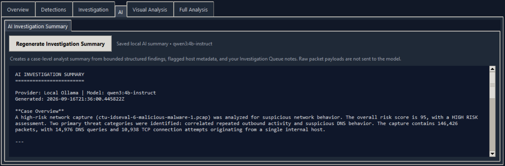

### Optional OpenAI API

The existing OpenAI-based explanation option remains available as an optional provider.

If OpenAI access is unavailable, disabled, or the API request fails, the analyzer's core analysis continues to work normally.

The raw PCAP file is not sent to the AI model.

## Visual Analysis

The GUI includes several interactive views for understanding capture behavior.

### Traffic Timeline

Shows packet activity over the duration of the capture.

Structured security findings can appear as timeline markers so detected behavior can be compared with surrounding traffic.

Representative packet evidence can also be highlighted at its exact capture offset.

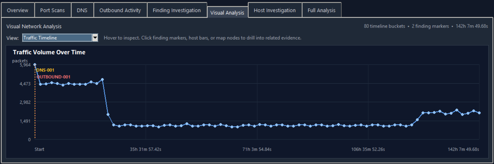

### DNS Activity Timeline

Shows DNS query activity over time and can help identify concentrated or unusually heavy DNS behavior.

### Protocol Distribution

Shows the protocols that make up the capture and their relative packet counts.

### Most Active Hosts

Ranks hosts by total observed packet activity.

The busiest host is not automatically suspicious, but this view helps identify systems that may deserve investigation.

### Top Destination Ports

Shows destination ports receiving the most traffic.

This can help highlight common services as well as less-common ports associated with repeated behavior.

### Network Relationship Map

Shows relationships between major hosts in the capture.

- Nodes represent hosts
- Lines represent observed communication relationships
- Larger nodes represent more active hosts
- Thicker lines represent more packet traffic between two hosts
- Flagged hosts use their risk color
- Normal or unflagged hosts are displayed separately
- Hovering shows host or relationship details
- Clicking a host opens it in Host Investigation

For larger captures, the map is intentionally limited to flagged and highly active hosts so the visualization remains readable.

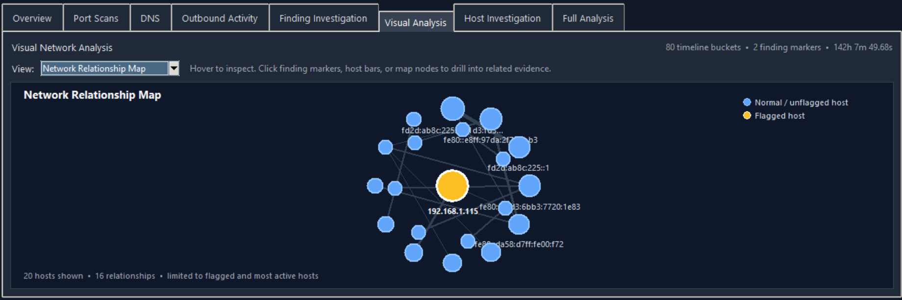

## Detection Methods

### Port Scan Detection

The analyzer tracks initial TCP SYN packets and looks for a single source contacting a large number of destination ports on the same target.

The detector considers:

- Number of unique destination ports
- Number of TCP SYN attempts
- Number of service and registered ports contacted
- Scan rate over time

The analyzer assigns either a `MODERATE` or `STRONG` scan confidence when the behavior exceeds configured thresholds.

### Suspicious DNS Behavior

DNS traffic is evaluated using several behavioral indicators:

- Total DNS query volume
- Number of unique domains
- Unique-domain ratio
- Concentration of queries toward a single domain
- Long DNS query names
- Very long DNS query names
- Average DNS query-name length

Multiple indicators are combined into a DNS behavior score.

### Correlated Repeated Outbound Activity

The analyzer looks for repeated TCP connection attempts from an internal host toward the same destination port across multiple external IP addresses.

The detector considers:

- Number of TCP SYN attempts
- Number of external destinations
- Destination port
- Timing between connection attempts
- Timing consistency
- Use of common or less-common destination ports

This behavior may indicate automated network activity, but it does not by itself prove malware or compromise.

### Generic Network Behavior

Individual network flows are also checked for characteristics such as:

- High packet rates
- Large data transfers
- Significant one-directional traffic
- Use of less-common destination ports

These findings are used as supporting evidence rather than standalone proof of malicious activity.

## Risk Scoring

The analyzer combines detected behaviors into an overall risk score.

| Score | Assessment |
|---|---|
| 75-100 | HIGH RISK |
| 50-74 | SUSPICIOUS |
| 25-49 | REVIEW RECOMMENDED |
| 0-24 | LIKELY NORMAL |

The score is intended to prioritize traffic for investigation and should not be treated as proof that a system is compromised.

## Validation Dataset

The analyzer has been tested using the CTU-IDSEVAL-6 intrusion detection evaluation dataset.

The dataset contains six PCAP captures:

- 1 benign traffic capture
- 2 malware-labeled captures
- 3 port-scan-labeled captures

The current regression baseline is:

| Capture | Expected Result |
|---|---|
| Benign user traffic | `0/100` — `LIKELY NORMAL` |
| Malware-labeled capture 1 | `95/100` — `HIGH RISK` |
| Malware-labeled capture 2 | `100/100` — `HIGH RISK` |
| Port-scan capture 1 | `60/100` — `SUSPICIOUS` |
| Port-scan capture 2 | `50/100` — `SUSPICIOUS` |
| Port-scan capture 3 | `60/100` — `SUSPICIOUS` |

The expected suspicious behavior was identified in all five malicious or scan-labeled captures while the benign capture remained at `0/100` during the established six-capture regression baseline.

These results only describe this small six-capture validation set and should not be interpreted as a general detection accuracy percentage.

## Example Results

### Benign Traffic

The benign capture received a **0/100** risk score with no threat categories detected.

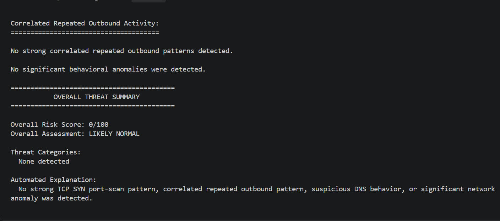

### Port Scan Detection

The analyzer identified a strong TCP SYN port-scanning pattern involving 945 distinct service or registered destination ports.

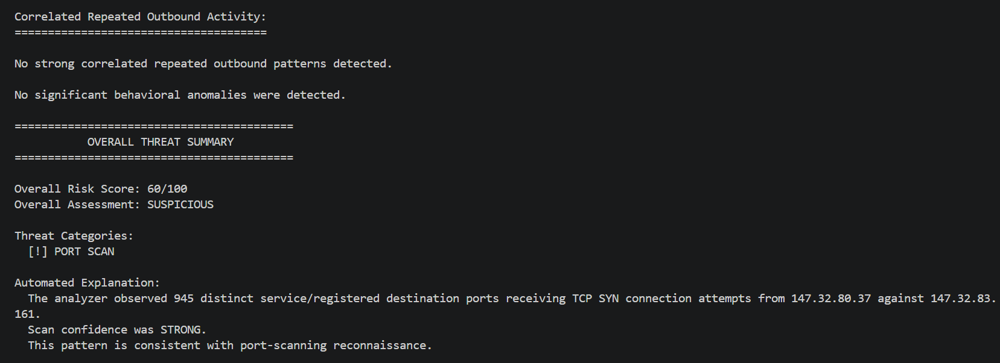

### High-Risk Traffic

The analyzer identified both correlated repeated outbound activity and suspicious DNS behavior, resulting in a **95/100 HIGH RISK** assessment.

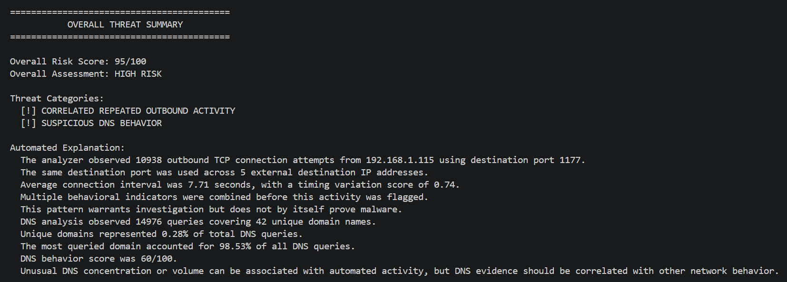

## Installation

### Requirements

Core requirements:

- Python 3
- Wireshark/TShark
- PyShark

Optional AI requirements:

- Ollama for free local AI explanations
- `qwen3:4b-instruct` or another configured compatible local Ollama model
- OpenAI Python package for the optional OpenAI explanation provider

Clone the repository and move into the project folder:

```powershell
git clone https://github.com/trentitan16/AI-PCAP-Security-Analyzer.git
cd AI-PCAP-Security-Analyzer
```

Create and activate a virtual environment on Windows:

```powershell
python -m venv .venv
.\.venv\Scripts\Activate.ps1
```

Install the Python dependencies:

```powershell
pip install -r requirements.txt
```

Wireshark/TShark must also be installed and available for PyShark to process PCAP files.

### Local Ollama Setup

Install Ollama for Windows, then verify the installation:

```powershell
ollama --version
```

Download and run the local model used during v1.5 development:

```powershell
ollama run qwen3:4b-instruct
```

After the model is available locally, the GUI can test the connection through its **Test Local AI** control.

An Ollama account is not required to use a local model.

## Usage

### Desktop GUI

Start the graphical interface with:

```powershell
python .\gui.py
```

Then:

1. Select a `.pcap`, `.pcapng`, or `.cap` file, or load a saved investigation case.
2. Choose whether to use an optional AI provider.
3. Choose whether to save standard TXT, JSON, and packet-evidence CSV reports.
4. Click **Analyze PCAP** if starting from a capture.
5. Review the grouped detection, investigation, AI, and visualization workspaces.
6. Use **Why Triggered** and **Analyst Review** to document finding triage.
7. Add findings, hosts, and packets to the Investigation Queue as needed.
8. Review the **Case Timeline** to connect packet evidence with analyst activity.
9. Optionally load a saved reference case in **Case Compare**.
10. Save the investigation with **Save Case** if you want to reopen it later.
11. Export standard reports, Indicators of Interest, or the polished HTML case report when needed.

### Command Line

Start the CLI with:

```powershell
python .\analyzer.py
```

Follow the interactive prompts to select and analyze PCAP files.

## Automated Regression Testing

Version 1.4 introduced `regression_test.py` for validating the six CTU-IDSEVAL-6 captures used during project testing.

Run:

```powershell
python .\regression_test.py
```

The script checks expected risk scores, assessments, core threat categories, and required investigation backends. A passing run exits with code `0`, which also makes the script suitable for future CI automation.

These regression expectations describe this six-capture validation set only and are not a general detection-accuracy claim.

## OpenAI API Setup

The OpenAI explanation provider is optional. The analyzer works without an API key.

If OpenAI explanations are enabled, the OpenAI Python SDK reads the API key from the `OPENAI_API_KEY` environment variable.

Do not commit API keys or other credentials to the repository.

## Report and Export Files

When standard report export is enabled, the analyzer creates:

```text
<pcap_name>_security_report.txt
<pcap_name>_security_report.json
<pcap_name>_packet_evidence.csv
```

The TXT report includes structured findings, representative evidence, Threat Hunt index information, and network relationship summaries. The JSON report preserves structured analyzer data. The CSV report contains bounded representative packet metadata and does not include packet payload content.

Reports are saved beside the analyzed PCAP file.

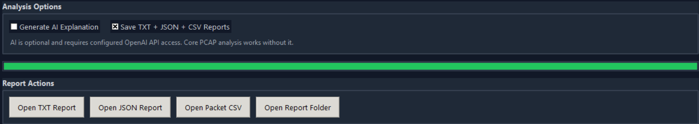

Additional investigation exports can include:

```text
<case_name>.pcapcase.json
<pcap_name>_indicators_of_interest.json
<pcap_name>_indicators_of_interest.csv
<pcap_name>_case_report.html
```

The v1.6 HTML case report is a separate analyst-facing export that can summarize case metadata, findings, analyst review, MITRE ATT&CK references, Indicators of Interest, the investigation timeline, saved AI summary content, and an optional comparison snapshot.

Generated reports, saved cases, PCAP captures, and other working artifacts should not be committed to the repository.

## Project Structure

```text
AI-PCAP-Security-Analyzer/
├── analyzer.py
├── gui.py
├── regression_test.py
├── requirements.txt
├── README.md
├── .gitignore
└── docs/
    └── screenshots/
        ├── benign-result.png
        ├── portscan-result.png
        ├── high-risk-result.png
        ├── gui-dashboard.png
        ├── finding-investigation.png
        ├── host-investigation.png
        ├── threat-hunt.png
        ├── investigation-queue.png
        ├── packet-evidence.png
        ├── packet-timeline.png
        ├── visual-analysis.png
        ├── network-map.png
        ├── report-export.png
        ├── why-triggered.png
        ├── case-timeline.png
        ├── case-compare.png
        └── html-case-report.png
```

## Limitations

- The analyzer uses heuristic and behavioral detection rather than signature-based malware identification.
- A suspicious finding does not prove that a host is compromised.
- Encrypted traffic limits visibility into application-layer content.
- Detection thresholds may behave differently on networks and datasets that differ from the validation captures.
- The validation results come from a small six-capture dataset and are not a general accuracy measurement.
- The tool is not intended to replace a production IDS, SIEM, EDR, or professional incident-response process.
- AI-generated explanations are optional summaries of structured findings and do not determine the analyzer's core risk score.
- Local-AI output can be incomplete or inaccurate and should be checked against the analyzer's structured evidence.
- MITRE ATT&CK mappings are intentionally conservative behavior references, not proof of compromise or attribution.
- Indicators of Interest are review candidates, not confirmed Indicators of Compromise.
- The Network Relationship Map intentionally limits large captures to a subset of flagged and highly active hosts for readability.
- Representative Packet Evidence is a bounded metadata sample and is not intended to display every packet associated with a finding.
- Threat Hunt searches indexed metadata collected during analysis and is not a full packet-content search engine.
- Saved investigation cases preserve analyzer state and analyst notes but are not a replacement for a production case-management platform.
- A matching PCAP SHA-256 hash confirms file equality with the saved hash, not that the capture itself is trustworthy.
- Automated regression expectations are tied to the six CTU-IDSEVAL-6 validation captures used by this project.
- The **Why Triggered** view explains existing detector logic; it does not independently detect threats or modify scores.
- Analyst dispositions and notes represent human review context and do not change the analyzer's original finding score.
- Case Comparison highlights differences between two analyzer results and is not, by itself, a maliciousness determination.
- The HTML case report is an investigation summary and should be reviewed alongside the underlying structured evidence when making security decisions.

## Version 1.6.0

Version 1.6.0 focuses on analyst triage, detection transparency, chronological case context, comparison, and investigation reporting while keeping the established core detection thresholds stable.

Major additions include:

- Analyst dispositions for structured findings
- Persistent analyst review notes
- **Why Triggered** detector-threshold and score breakdowns
- Unified Investigation Timeline combining capture evidence and analyst activity
- Timeline filtering for capture events and analyst activity
- Queue and review timestamps for new analyst timeline events
- PCAP / saved-case comparison workspace
- Current-versus-reference metric differences
- Finding-type and analyst-disposition comparison
- Polished browser-friendly HTML investigation case reports
- Case metadata and source-integrity information in HTML reports
- Structured findings, analyst reviews, MITRE ATT&CK mappings, flagged hosts, and Indicators of Interest in HTML reports
- Investigation Queue, analyst notes, saved AI summary, timeline, and optional comparison snapshot in HTML reports
- Updated v1.6 investigation screenshots and documentation

The full six-capture CTU-IDSEVAL-6 regression suite passed unchanged before release:

| Capture | v1.6.0 Result |
|---|---|
| Benign user traffic | `0/100` — `LIKELY NORMAL` |
| Malware-labeled capture 1 | `95/100` — `HIGH RISK` |
| Malware-labeled capture 2 | `100/100` — `HIGH RISK` |
| Port-scan capture 1 | `60/100` — `SUSPICIOUS` |
| Port-scan capture 2 | `50/100` — `SUSPICIOUS` |
| Port-scan capture 3 | `60/100` — `SUSPICIOUS` |

Detection thresholds were intentionally kept stable while analyst workflow, explainability, case comparison, and reporting capabilities were expanded.

## Version 1.5.0

Version 1.5.0 expands the project from an investigation workflow into an AI-assisted, persistent case-analysis environment.

Major additions include:

- Persistent Save Case / Load Case workflow
- `.pcapcase.json` investigation case format
- Case IDs and created/modified metadata
- Original-PCAP SHA-256 integrity verification
- Free local AI support through Ollama
- Local `qwen3:4b-instruct` integration
- Capture-wide local AI explanations
- Focused AI Finding Investigation explanations
- Focused AI Host Investigation explanations
- Persistent AI Investigation Summary
- Investigation Queue and analyst-note persistence
- Indicators of Interest workspace
- Indicators of Interest JSON and CSV export
- Grouped GUI workspaces for cleaner navigation
- Conservative MITRE ATT&CK mapping
- `T1046` Network Service Discovery mapping for explicit port/service-scan findings
- Direct links from supported findings to official MITRE ATT&CK references

Detection thresholds were intentionally kept stable while AI assistance, case persistence, evidence organization, and analyst workflow capabilities were expanded.

## Version 1.4.0

Version 1.4.0 expanded the project into a more complete analyst investigation workflow.

Major additions include:

- Threat Hunt workspace
- Search by IP address, domain, destination port, protocol, and Finding ID
- Threat Hunt-to-Host and Threat Hunt-to-Finding navigation
- Packet Evidence-to-Timeline linking
- Exact packet capture-offset highlighting on the Traffic Timeline
- Automated six-capture regression testing
- Enhanced structured TXT reports
- Packet-evidence CSV export
- Investigation Queue
- Finding, Host, and Packet bookmarking
- Analyst notes
- Queue-to-Finding, Queue-to-Host, and Queue Packet-to-Timeline navigation
- JSON Investigation Queue export for case handoff

Detection thresholds were intentionally kept stable while investigation, evidence, testing, and case-workflow capabilities were expanded.

## Version 1.3.0

Version 1.3.0 expanded the project from a detection dashboard into a cross-linked network investigation workspace.

Major additions include:

- Structured Finding Investigation
- Finding identifiers and review-priority filtering
- Representative Packet Evidence
- Host Investigation improvements
- Finding-to-host and host-to-finding navigation
- Timeline-to-finding navigation
- Host-chart-to-host navigation
- Interactive Traffic Timeline
- DNS Activity Timeline
- Protocol Distribution chart
- Most Active Hosts chart
- Top Destination Ports chart
- Interactive Network Relationship Map
- Network-map-to-host navigation
- Determinate packet-processing progress
- Structured visualization and relationship-map backend data
- Regression validation across all six CTU-IDSEVAL-6 captures
- Report export regression testing
- Command-line regression testing

Detection thresholds were intentionally kept stable while the investigation and visualization layers were expanded.

## Version 1.2.0

Version 1.2.0 added:

- Host Investigation
- Host-level activity summaries
- Suspicious-host prioritization
- Port-scan target context
- Determinate packet-processing progress
- Improved GUI investigation workflow

## Version 1.1.0

Version 1.1.0 introduced the desktop GUI and expanded the project from a command-line analyzer into a graphical defensive network-analysis application.

Major additions included:

- Security dashboard GUI
- Responsive background analysis
- Optional AI control in the GUI
- Optional report export in the GUI
- TXT and JSON report access controls
- Scrollable dashboard layout
- Improved presentation of detection results

## Disclaimer

This project is intended for defensive cybersecurity education, authorized network analysis, and portfolio demonstration.

Only analyze network captures that you are authorized to access.
